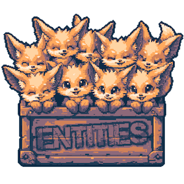

## ... the tiny, tiny, high-energy Entity Component System!

[](https://github.com/thygrrr/fennECS/issues)
[](https://github.com/thygrrr/fennECS/actions)


<table style="border: none; border-collapse: collapse; width: 80%">
    <tr>
        <td>
            
        </td>
        <td style="width: 70%">
            <h3><a href="https://fennecs.tech">fennECS</a> is...</h3>
            <ol style='list-style-type: "🐾 ";'>
                <li>zero codegen</li>
                <li>minimal boilerplate</li>
                <li>archetype-based</li>
                <li>intuitively relational</li>
                <li>lithe and fast</li>
            </ol>
            This re-imagined fork of <a href="https://github.com/Byteron/HypEcs">HypEcs</a> <em>feels just right</em> for high performance game development in any modern C# engine. Including, of course, the fantastic <a href="https://godotengine.org">Godot</a>. 
        </td>
    </tr>
</table>

## Quickstart

```csharp
// Declare or use any existing value or reference type as a component.
using Position = System.Numerics.Vector3;

// Create a world.
World world = new World();

// Spawn a new entity into the world with a Vector3 component
Entity entity = world.Spawn().Add<Position>().Id();

// Queries are cached, just build them right where you want to use them.
var query = world.Query<Vector3>().Build();

// Run code on all entities in the query. Omit chunk size to just parallelize per archetype.
query.RunParallel((ref position) => {
    position.Y -= 0.98f * Time.Delta;
}, chunkSize: 8192);
```

## What the fox!? Another ECS?

I know, I know. To help you choose, here are some of the key properties where fennECS might be a better or worse choice than its peers.

|                                                               |      fennECS       | HypEcs | Entitas |   Unity DOTS   | DefaultECS |
|:--------------------------------------------------------------|:------------------:|:------:|:-------:|:--------------:|:----------:|
| Boilerplate-to-Feature Ratio                                  |       3-to-1       | 3-to-1 | 12-to-1 |   27-to-1 😱   |   5-to-1   |
| Entity-Target Relations                                       |         ✅          |   ✅    |    ❌    |       ❌        |     ❌      |
| Target Querying<br/>*(find all targets of relations of type)* |         ✅          |   ❌    |    ❌    |       ❌        |     ❌      |
| Entity-Component Queries                                      |         ✅          |   ✅    |    ✅    |       ✅        |     ✅      |
| Add Shared Components                                         |         ✅          |   🟨   |    ❌    |       🟨       |     ✅      | 
| Change Shared Components                                      |         ✅          |   🟨   |    ❌    |       ❌        |     ✅      | 
| Entity-Type-Relations                                         |         ❌          |   ✅    |    ❌    |       ❌        |     ❌      |
| Entity-Target-Querying                                        |         ✅          |   ❌    |    ❌    |       ❌        |     ❌      |
| Arbitrary Component Types                                     |         ✅          |   ✅    |    ❌    |       ❌        |     ✅      |
| Reliable State Change Response                                |         🟨         |   ❌    |    ✅    |       ❌        |     ❌      |
| No Code Generation Required                                   |         ✅          |   ✅    |    ❌    |       ❌        |     🟨     |
| Submit Structural Changes at Any Time                         |         ✅          |   ✅    |    ✅    |       🟨       |     🟨     |
| Apply Structural Changes at Any Time                          |         ❌          |   ❌    |    ✅    |       ❌        |     ❌     |
| C# 12 support                                                 |         ✅          |   ❌    |    ❌    |       ❌        |     ❌      |
| Parallel Processing                                           |         ⭐⭐         |   ⭐    |    ❌    |      ⭐⭐⭐   |     ⭐⭐     |
| Singleton / Unique Components                                 | 🟨(ref types only) |   ❌    |    ✅    | 🟨(per system) |     ✅      |
| Journaling                                                    |         ❌          |   ❌    |   🟨    |       ✅        |     ❌      |


## Highlights / Design Goals

- Entity-Entity-Relations with O(1) lookup time complexity.
- Entity-Component Queries with O(1) lookup time complexity.
- Entity Spawning and De-Spawning with O(1) time complexity.
- Entity Structural Changes with O(1) time complexity (per individual change).

- Workloads can be parallelized across Archetypes (old) and within Archetypes (new).

- Unit Test coverage.
- Benchmarking suite.
- Modern C# 12 codebase, targeting .NET 8.
- Godot 4.x Sample Integrations.

## Future Roadmap

- Unity Support: Planned for when Unity is on .NET 7 or later, and C# 12 or later.
- fennECS as a NuGet package
- fennECS as a Godot addon

## Already plays well with Godot 4.x!


# Legacy Documentation

## Components

```csharp
// Components are simple structs.
struct Position { public int X, Y; }
struct Velocity { public int X, Y; }
```

## Systems

```csharp
// Systems add all the functionality to the Entity Component System.
// Usually, you would run them from within your game loop.
public class MoveSystem : ISystem
{
    public void Run(World world)
    {
        // iterate sets of components.
        var query = world.Query<Position, Velocity>().Build();
        query.Run((count, positions, velocities) => {
            for (var i = 0; i < count; i++)
            {
                positions[i].X += velocities[i].X;
                positions[i].Y += velocities[i].Y;
            }
        });
    }
}
```

### Spawning / De-Spawning Entities

```csharp
public void Run(World world)
{
    // Spawn a new entity into the world and store the id for later use
    Entity entity = world.Spawn().Id();
    
    // Despawn an entity.
    world.Despawn(entity);
}
```

### Adding / Removing Components

```csharp
public void Run(World world)
{
    // Spawn an entity with components
    Entity entity = world.Spawn()
        .Add(new Position())
        .Add(new Velocity { X = 5 })
        .Add<Tag>()
        .Id();
    
    // Change an Entities Components
    world.On(entity).Add(new Name { Value = "Bob" }).Remove<Tag>();
}
```

### Relations

```csharp
// Like components, relations are structs.
struct Apples { }
struct Likes { }
struct Owes { public int Amount; }
```

```csharp
public void Run(World world)
{
    var bob = world.Spawn().Id();
    var frank = world.Spawn().Id();
    
    // Relations consist of components, associated with a "target".
    // The target can either be another component, or an entity.
    world.On(bob).Add<Likes>(typeof(Apples));
    //   Component           ^^^^^^^^^^^^^^
    
    world.On(frank).Add(new Owes { Amount = 100 }, bob);
    //                                      Entity ^^^
    
    // if you want to know if an entity has a component
    bool doesBobHaveApples = world.HasComponent<Apples>(bob);
    // if you want to know if an entity has a relation
    bool doesBobLikeApples = world.HasComponent<Likes>(bob, typeof(Apples));
    
    // Or get it directly.
    // In this case, we retrieve the amount that Frank owes Bob.
    var owes = this.GetComponent<Owes>(frank, bob);
    Console.WriteLine($"Frank owes Bob {owes.Amount} dollars");
}
```

### Queries

```csharp
public void Run(World world)
{
    // With queries, we can get a list of components that we can iterate through.
    // A simple query looks like this
    var query = world.Query<Position, Velocity>().Build();
    
    // Now we can loop through these components
    query.Run((count, positions, velocities) => 
    {
        for (var i = 0; i < count; i++)
        {
            positions[i].X += velocities[i].X;
            positions[i].Y += velocities[i].Y;
        }
    });
    
    // we can also iterate through them using multithreading!
    // for that, we simply replace `Run` with `RunParallel`
    // note that HypEcs is an arche type based ECS.
    // when running iterations multithreaded, that means we parallelise each *Table* in the ecs,
    // not each component iteration. This means MultiThreading benefits from archetype fragmentation,
    // but does not bring any benefits when there is only one archetype existing in the ecs that is iterated.
    query.RunParallel((count, positions, velocities) => 
    {
        for (var i = 0; i < count; i++)
        {
            positions[i].X += velocities[i].X;
            positions[i].Y += velocities[i].Y;
        }
    });
    
    // You can create more complex, expressive queries through the QueryBuilder.
    // Here, we request every entity that has a Name component, owes money to Bob and does not have the Dead tag.
    var appleLovers = world.QueryBuilder<Entity, Name>().Has<Owes>(bob).Not<Dead>().Build();
    
    // Note that we only get the components inside Query<>.
    // Has<T>, Not<T> and Any<T> only filter, but we don't actually get T in the loop.
    appleLovers.Run((count, entities, names) => 
    {
        for (var i = 0; i < count; i++)
        {
            Console.WriteLine($"Entity {entities[i]} with name {names[i].Value} owes bob money and is still alive.")
        }
    });
}
```

## Creating a World

```csharp
// A world is a container for different kinds of data like entities & components.
World world = new World();
```

## Running a System

```csharp
// Create an instance of your system.
var moveSystem = new MoveSystem();

// Run the system.
// The system will match all entities of the world you enter as the parameter.
moveSystem.Run(world);

// You can run a system as many times as you like.
moveSystem.Run(world);
moveSystem.Run(world);
moveSystem.Run(world);

// Usually, systems are run once a frame, inside your game loop.
```

## SystemGroups

```csharp
// You can create system groups, which bundle together multiple systems.
SystemGroup group = new SystemGroup();

// Add any amount of systems to the group.
group.Add(new SomeSystem())
     .Add(new SomeOtherSystem())
     .Add(new AThirdSystem());

// Running a system group will run all of its systems in the order they were added.
group.Run(world);
```

## Example of a Game Loop

```csharp
// In this example, we are using the Godot Engine.
using Godot;
using HypEcs;
using World = HypEcs.World; // Godot also has a World class, so we need to specify this.

public class GameLoop : Node
{
    World world = new World();

    SystemGroup initSystems = new SystemGroup();
    SystemGroup runSystems = new SystemGroup();
    SystemGroup cleanupSystems = new SystemGroup();

    // Called once on node construction.
    public GameLoop()
    {
        // Add your initialization systems.
        initSystem.Add(new SomeSpawnSystem());

        // Add systems that should run every frame.
        runSystems.Add(new PhysicsSystem())
            .Add(new AnimationSystem())
            .Add(new PlayerControlSystem());
        
        // Add systems that are called once when the Node is removed.
        cleanupSystems.Add(new DespawnSystem());
    }

    // Called every time the node is added to the scene.
    public override void _Ready()
    {
        // Run the init systems.
        initSystems.Run(world);   
    }

    // Called every frame. Delta is time since the last frame.
    public override void _Process(float delta)
    {
        // Run the run systems.
        runSystems.Run(world);

        // IMPORTANT: For HypEcs to work properly, we need to tell the world when a frame is done.
        // For that, we call Tick() on the world, at the end of the function.
        world.Tick();
    }

    // Called when the node is removed from the SceneTree.
    public override void _ExitTree()
    {
        // Run the cleanup systems.
        cleanupSystems.Run(world);
    }
}
```
